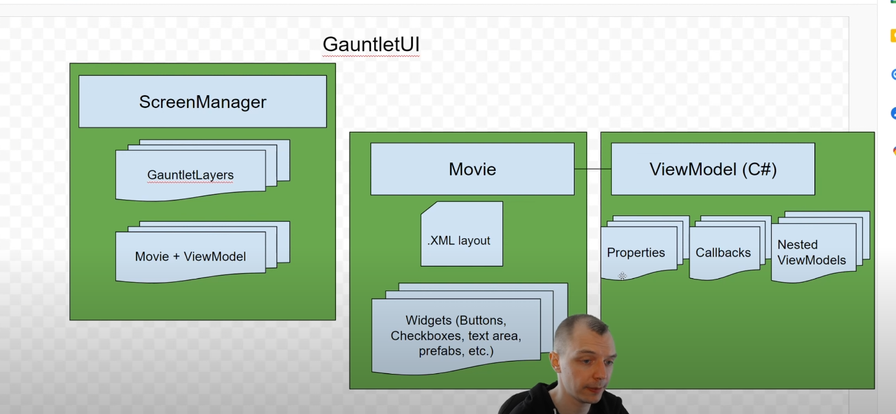

# Useful information


## Doc

* Inworld API: https://studio.inworld.ai/workspaces/default-ibnuyu5uug-lnmebb0pd9w/characters
* Inworld Mod installation guide: https://bloctheworker.github.io/Inworld-Bannerlord-Mod/installation/
* Bannerlord wiki: https://mountandblade2bannerlord.wiki.fextralife.com
* Bannerlord API doc: https://apidoc.bannerlord.com/v/1.2.7/
* **Harmony** introduction: https://harmony.pardeike.net/articles/patching.html
* official docs: https://moddocs.bannerlord.com/
* **ChatGPT API**: https://platform.openai.com/playground/p/default-sql-translate?mode=chat
* **ChatGPT C# lib**: https://github.com/OkGoDoIt/OpenAI-API-dotnet
* CharacterAI-NET-API-Wrapper: https://github.com/drizzle-mizzle/CharacterAI-NET-API-Wrapper/wiki/Getting-started.
* ChatGPT4All: https://docs.gpt4all.io/
* ChatGPT4All C#: https://github.com/mvenditto/gpt4all/tree/980cbd552278c938fecaee482eed41fa9338b742/gpt4all-bindings/csharp
* Mantella: https://github.com/art-from-the-machine/Mantella
* text-generation-webui: https://github.com/oobabooga/text-generation-webui 
## tutorial
* 骑马与砍杀2MOD制作精华索引贴: https://bbs.mountblade.com.cn/thread-2061939-1-1.html
* C# tutorial on bilibili : https://www.bilibili.com/video/BV1UK4y1v713/?vd_source=813e8158652bb9c4b0fca669180455
* C# tutorial by **Microsoft**: https://learn.microsoft.com/en-gb/training/modules/csharp-call-methods/4-return-values-input-parameters

* Modding tutorial on Youtube from Lesser Scholar: https://www.youtube.com/watch?v=_MGKjydqXPM&list=PLzebdAxJeltRwfJ8jzsNolgHkRvLjoCRC&index=7
* Modding documents: https://docs.bannerlordmodding.com/_intro/getting-started.html#creating-a-module
* How to debug: [PDF version](./Here%20is%20a%20small%20tutorial%20to%20debug%20MB2Bannerlord.pdf)
* .NET reflection tutorial: https://dotnetcademy.net/Learn/4/Pages/2

* ChatGPT API in China: https://github.com/Sha1rholder/use-ChatGPT-in-GFW?tab=readme-ov-file#%E5%88%9D%E9%98%B6chatgpt
## Local
Modules location: E:\Games\Steam\steamapps\common\Mount & Blade II Bannerlord\Modules

press Windows key+Alt+R to record video

## Prompt notes
For character

* I want you to act like {character} from {series}. I want you to respond and answer like {character} using the tone, manner and vocabulary {character} would use. Do not write any explanations. Only answer like {character}. You must know all of the knowledge of {character}. My first sentence is "Hi {character}."*


## Coding Notes

**Display message in game.**

    InformationManager.DisplayMessage(new InformationMessage(
        "Bannerlord.ChatGPT has been loaded".ToString()));

For this mod, I will mostly focus on the conversation part.
The **Conversation** are combined with following things.

    // TaleWorlds.CampaignSystem.Conversation
    // 
    // Types:
    // 
    // CampaignMapConversation
    // ConversationAnimationManager
    // ConversationAnimData
    // ConversationCharacterData
    // ConversationHelper
    // ConversationManager
    // ConversationSentence
    // ConversationSentenceOption
    // ConversationToken
    // ConversationTokens
    // IConversationStateHandler
    // MapConversationAgent


All the methods are stored in the **ConversationManager**

    namespace TaleWorlds.CampaignSystem.Conversation
    {
    	// Token: 0x020001EA RID: 490
    	public class ConversationManager
    	{

**CampaignMapConversation**: I guess it is the stater of the conversation when your campaign is talking to you about things recently happened.

    using System;
    
    namespace TaleWorlds.CampaignSystem.Conversation
    {
    	// Token: 0x020001E3 RID: 483
    	public static class CampaignMapConversation
    	{
    		// Token: 0x06001D73 RID: 7539 RVA: 0x00084E20 File Offset: 0x00083020
    		public static void OpenConversation(ConversationCharacterData playerCharacterData, ConversationCharacterData conversationPartnerData)
    		{
    			Campaign.Current.ConversationManager.OpenMapConversation(playerCharacterData, conversationPartnerData);
    		}
    	}
    }

basically it just called **OpenMapConversation**
```csharp
public void OpenMapConversation(ConversationCharacterData playerCharacterData, ConversationCharacterData conversationPartnerData)
    		{
    			GameStateManager gameStateManager = GameStateManager.Current;
    			(((gameStateManager != null) ? gameStateManager.ActiveState : null) as MapState).OnMapConversationStarts(playerCharacterData, conversationPartnerData);
    			PartyBase party = conversationPartnerData.Party;
    			this.SetupAndStartMapConversation((party != null) ? party.MobileParty : null, new MapConversationAgent(conversationPartnerData.Character), new MapConversationAgent(CharacterObject.PlayerCharacter));
    		}
```
AddToCurrentOptions

    public void AddToCurrentOptions(TextObject text, string id, bool isClickable, TextObject hintText)

Important!!!: **AddPlayerLine**

Augments:
1. ID for this Line
2. Conversation state before this line
3. Conversation state after this line


```csharp
 ConversationSentence AddPlayerLine(string idforthisLine, string inputToken, string outputToken, string text, ConversationSentence.OnConditionDelegate conditionDelegate, ConversationSentence.OnConsequenceDelegate consequenceDelegate, int priority = 100, ConversationSentence.OnClickableConditionDelegate clickableConditionDelegate = null, ConversationSentence.OnPersuasionOptionDelegate persuasionOptionDelegate = null)
```


Example

```csharp
protected void AddDialogs(CampaignGameStarter cgs)
		{
			cgs.AddDialogLine("talk_common_to_tavernkeeper", "start", "tavernkeeper_talk", "{=QCuxL92I}Good day, {?PLAYER.GENDER}madam{?}sir{\\?}. How can I help you?", () => CharacterObject.OneToOneConversationCharacter.Occupation == Occupation.Tavernkeeper, null, 100, null);
			cgs.AddPlayerLine("tavernkeeper_talk_to_get_quest", "tavernkeeper_talk", "tavernkeeper_ask_quests", "{=A61ppTa6}Do you know of anyone who might have a task for someone like me?", null, null, 100, null, null);
			cgs.AddPlayerLine("tavernkeeper_get_clan_info_start", "tavernkeeper_talk", "tavernkeeper_offer_clan_info", "{=shXdvd5p}I'm looking for information about the owner of this town.", null, null, 100, null, null);
			cgs.AddDialogLine("tavernkeeper_get_clan_info_answer", "tavernkeeper_offer_clan_info", "player_offer_clan_info", "{=i96KTeph}I can sell you information about {OWNER_CLAN}, who are the owners of our town {SETTLEMENT} for {PRICE}{GOLD_ICON}.", new ConversationSentence.OnConditionDelegate(this.tavernkeeper_offer_clan_info_on_condition), null, 100, null);
			cgs.AddPlayerLine("tavernkeeper_get_clan_info_player_answer_1", "player_offer_clan_info", "tavernkeeper_pretalk", "{=VaxbQby7}That sounds like a great deal.", null, new ConversationSentence.OnConsequenceDelegate(this.player_accepts_clan_info_offer_on_consequence), 100, new ConversationSentence.OnClickableConditionDelegate(this.player_accepts_clan_info_offer_clickable_condition), null);
			cgs.AddPlayerLine("tavernkeeper_get_clan_info_player_answer_2", "player_offer_clan_info", "tavernkeeper_pretalk", "{=CH7b5LaX}I have changed my mind.", null, null, 100, null, null);
			cgs.AddPlayerLine("tavernkeeper_companion_info_start", "tavernkeeper_talk", "tavernkeeper_companion_info_tavernkeeper_answer", "{=e9xd15Db}I am looking for some people to hire with specific skills. Would you happen to know anyone looking for work in the towns of the {FACTION_INFORMAL_NAME}? ", new ConversationSentence.OnConditionDelegate(this.tavernkeeper_talk_companion_on_condition), null, 100, null, null);
			
			this.AddRansomBrokerDialogs(cgs);
		}
```


## UI notes


